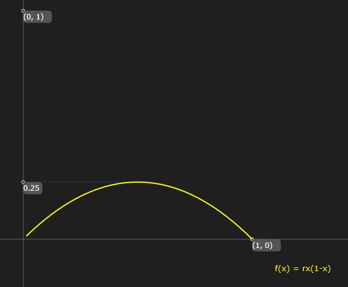

# Interpreting the Dynamics of the Logistic Map Using an Inverse Cobweb Diagram

## Abstract
This paper explores the mathematical intricacies of the logistic map, its inverse map, and the dynamics of controlled chaos. We delve into the properties of the logistic map, its inverse, and their intersection points. Furthermore, we analyze the iterative sequences generated by alternating between the logistic map and its inverse, leading to the construction of an inverse cobweb diagram. Finally, we investigate the conditions for a stable iteration cycle with three nodes and present bifurcation diagrams for the logistic map and a sinusoidal variant.

---

## 1. Introduction
The logistic map is a fundamental mathematical model used to describe population dynamics, chaos theory, and bifurcation phenomena. Defined as a simple quadratic recurrence relation, the logistic map exhibits a rich variety of behaviors, ranging from fixed points to chaotic oscillations. This paper extends the classical analysis by incorporating the inverse logistic map and exploring the interplay between the two maps.

---

## 2. The Logistic Map 
We consider the logistic map as a function f:[0,1]→[0,1] defined by:
$$
f(x) = r x (1 - x)
$$
where:
- $x \in [0,1]$
- $r \in [0,4]$

The logistic map is an endofunction on the interval $[0,1]$, mapping values within this range back into the same interval.

---

## 3. The Inverse Logistic Map
The inverse of the logistic map $y = f(x)$ is given by:
$$
f^{-1}(y) = \frac{1}{2}\left(1 \pm \sqrt{1 - 4\frac{y}{r}}\right)
$$
This inverse function is defined for $y \in [0, r/4]$, ensuring that the square root term remains real.

---

## 4. Intersection Points
The intersection points of $f(x)$ and $f^{-1}(x)$ depend on the parameter $r$:

### Case 1: $0 \leq r \leq 1$
There is only one intersection point:
$$
X_0 = 0
$$

### Case 2: $1 < r \leq 3$
There are two intersection points:
$$
X_0 = 0
$$
$$
X_1 = \frac{r-1}{r}
$$

### Case 3: $3 < r \leq 4$
There are four intersection points:
$$
X_0 = 0
$$
$$
X_1 = \frac{r-1}{r}
$$
$$
X_2 = \frac{1}{2r}(r+1 - \sqrt{r^2 - 2r - 3})
$$
$$
X_3 = \frac{1}{2r}(r+1 + \sqrt{r^2 - 2r - 3})
$$

---

## 5. Iteration Sequence
The iterative sequence alternates between the logistic map $f(x)$ and its inverse $f^{-1}(x)$:
$$
x_{n+1} =
\begin{cases}
f(x_n), & \text{if } n = 2k,\ k \in \mathbb{W} \\
f^{-1}(x_n), & \text{if } n = 2k + 1,\ k \in \mathbb{W}
\end{cases}
$$

For $x_0 \in [0,1]$:
$$
x_1 = f(x_0)
$$
$$
x_2 = f^{-1}(x_1) = f^{-1}(f(x_0))
$$
$$
x_3 = f(x_2) = f(f^{-1}(f(x_0)))
$$
$$
x_4 = f^{-1}(x_3) = f^{-1}(f(f^{-1}(f(x_0))))
$$

For the logistic map, the sequence becomes:
$$
x_{n+1} =
\begin{cases}
r x_n (1 - x_n), & \text{if } n = 2k,\ k \in \mathbb{W} \\
\frac{1}{2}\left(1 \pm \sqrt{1 - \frac{4x_n}{r}}\right), & \text{if } n = 2k + 1,\ k \in \mathbb{W}
\end{cases}
$$

---

## 6. Inverse Cobweb Diagram
A cobweb diagram is a geometric visualization of repeated function iteration. Traditionally, it shows how values bounce between the function curve $y = f(x)$ and the diagonal line $y = x$. In this paper, we replace the diagonal line with the inverse function curve $y = f^{-1}(x)$:
$$
y = \frac{1}{2}\left(1 \pm \sqrt{1-4\frac{x}{r}}\right)
$$
This approach provides a novel perspective on the dynamics of the logistic map.

---

## 7. Stable Iteration Cycle with Three Nodes
For certain values of $r$ (denoted as $r_o$), the iteration sequence stabilizes into a three-node cycle. To calculate $r_o$, we solve the following equations:

### Equation 1
$$
f(x) = \frac{1}{2}, \quad r > 2
$$
$$
rx(1-x) = \frac{1}{2}
$$
Solutions for $r > 2$:
$$
x_{o1} = \frac{r-\sqrt{(r-2)r}}{2r}
$$
$$
x_{o2} = \frac{r+\sqrt{(r-2)r}}{2r}
$$

### Equation 2
$$
f^{-1}(x_{o1}) = f\left(\frac{1}{2}\right), \quad r > 2
$$
$$
\frac{1}{2}\left(1+\sqrt{1-4\frac{r-\sqrt{(r-2)r}}{2r^2}}\right) = \frac{r}{4}
$$

The solution for $r > 2$ is:
$$
r_o = 1 + \sqrt{1 + \frac{1}{3}\left(8 + (800 - 96\sqrt{69})^{1/3} + 2 \cdot 2^{2/3}(25 + 3\sqrt{69})^{1/3}\right)}
$$
$$
r_o \approx 3.8318740552833155684103627754961065557978278526036946304788904477
$$

---

## 8. Bifurcation Diagrams
### 8.1 Logistic Map
The bifurcation diagram for $f(x) = rx(1-x)$ illustrates the transition from stability to chaos as $r$ increases.

### 8.2 Sinusoidal Variant
The bifurcation diagram for $f(x) = \frac{r}{4} \sin(\pi x)$ provides an alternative perspective on the dynamics of controlled chaos.

---

## 9. Conclusion
This paper has presented a detailed analysis of the logistic map, its inverse, and their interplay. By exploring the iterative dynamics and constructing the inverse cobweb diagram, we have gained new insights into the behavior of controlled chaos. The identification of a stable three-node cycle and the bifurcation diagrams further highlight the richness of this mathematical system.

---

## References
1. May, R. M. (1976). "Simple mathematical models with very complicated dynamics." Nature, 261(5560), 459-467.
2. Strogatz, S. H. (2018). "Nonlinear Dynamics and Chaos: With Applications to Physics, Biology, Chemistry, and Engineering." CRC Press.
3. Devaney, R. L. (1989). "An Introduction to Chaotic Dynamical Systems." Addison-Wesley.
