# Interpreting the Dynamics of the Logistic Map Using an Inverse Cobweb Diagram

**Author:** Viktor Rom

**Date:** March 15, 2026

---

## Abstract

This paper explores the mathematical intricacies of the logistic map, its inverse map, and the dynamics of controlled chaos. We delve into the properties of the logistic map, its inverse, and their intersection points. Furthermore, we analyze the iterative sequences generated by alternating between the logistic map and its inverse, leading to the construction of an inverse cobweb diagram. Finally, we investigate the conditions for a stable iteration cycle with three nodes and present bifurcation diagrams for the logistic map and a sinusoidal variant.

---

## 1. Introduction

The logistic map is a fundamental mathematical model used to describe population dynamics, chaos theory, and bifurcation phenomena [1]. Defined as a simple quadratic recurrence relation, the logistic map exhibits a rich variety of behaviors, ranging from fixed points to chaotic oscillations [4, 5]. This paper extends the classical analysis by incorporating the inverse logistic map and exploring the interplay between the two maps.

---

## 2. The Logistic Map

We consider the logistic map as a function $f : [0,1] \to [0,1]$ defined by:
$$
f(x) = r x (1 - x)
$$
where:

- $x \in [0,1]$
- $r \in [0,4]$

The logistic map is an endofunction on the interval $[0,1]$, mapping values within this range back into the same interval.

---

## 3. The Inverse Logistic Map

The inverse of the logistic map is given by:
$$
f^{-1}(x) = \frac{1}{2}\left(1 \pm \sqrt{1 - 4\frac{x}{r}}\right)
$$

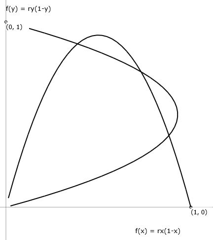

It maps values on the $y$-axis back to $x$.

$x = f(y)$

This inverse function is defined for $x \in [0, r/4]$, ensuring that the square root term remains real.

---

## 4. Intersection Points

The intersection points of $f(x)$ and $f^{-1}(x)$ depend on the parameter $r$:

### Case 1: $0 \leq r \leq 1$

There is only one intersection point:
$$
X_0 = 0
$$

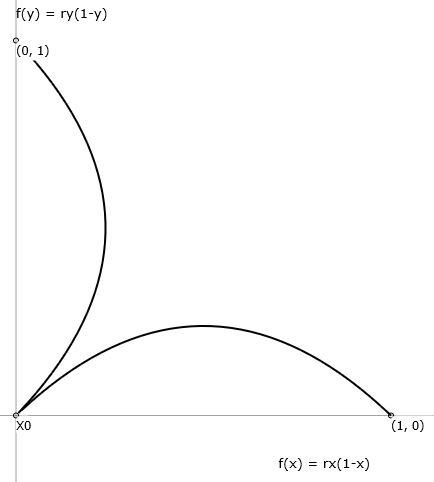

### Case 2: $1 < r \leq 3$

There are two intersection points:
$$
X_0 = 0
$$
$$
X_1 = \frac{r-1}{r}
$$

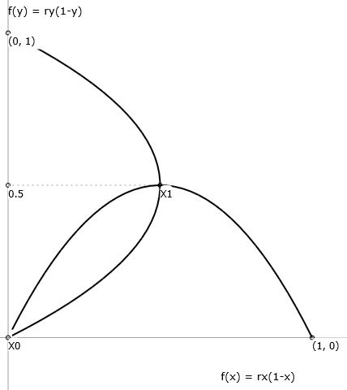

### Case 3: $3 < r \leq 4$

There are four intersection points:
$$
X_0 = 0
$$
$$
X_1 = \frac{r-1}{r}
$$
$$
X_2 = \frac{1}{2r}(r+1 - \sqrt{r^2 - 2r - 3})
$$
$$
X_3 = \frac{1}{2r}(r+1 + \sqrt{r^2 - 2r - 3})
$$

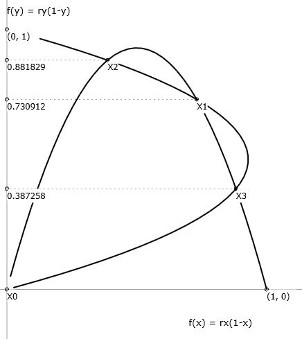

---

## 5. Iteration Sequence

### Step 1

The sequence starts at an arbitrary value $x_0$, where

- $x_0 \in [0,1]$
- $r \in [0,4]$

Applying the Logistic Map to $x_0$, we get the value $x_1$ on the $y$-axis.

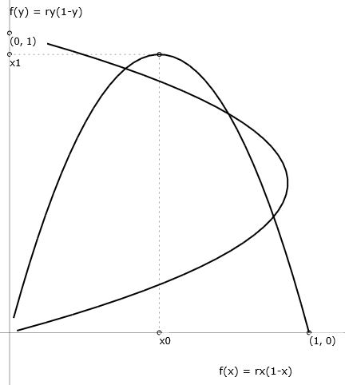

### Step 2

The next iteration value $x_2$ is obtained by applying $x_1$ to the same Logistic Map projected onto the $y$-axis ($x = f(y)$):

$x_2 = f(x_1)$

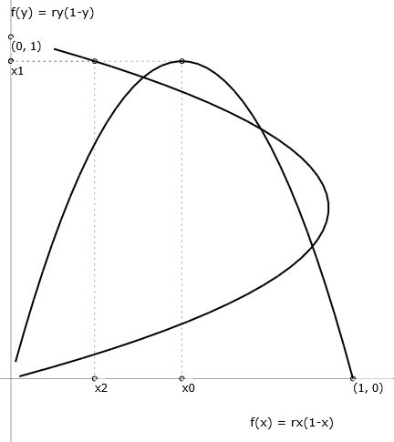

### Step 3

Applying $x_2$ on the $x$-axis to the Logistic Map, we get a new value $x_3$ on the $y$-axis.

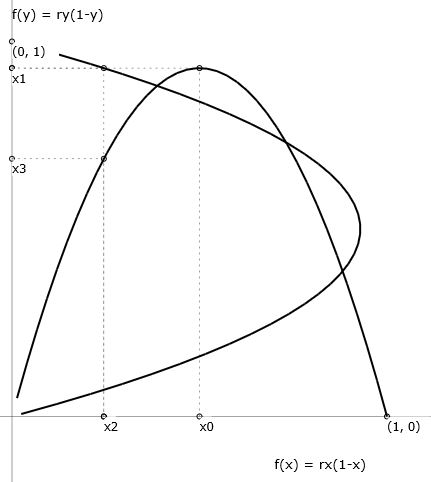

### Step 4

$x_4$ is obtained by applying $x_3$ to the same Logistic Map on the $y$-axis:

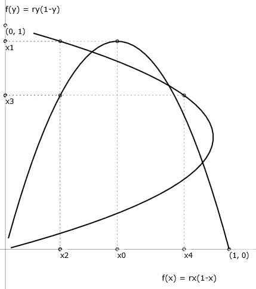

### Step 5

Applying $x_4$ on the $x$-axis to the Logistic Map, we get a new value $x_5$ on the $y$-axis.

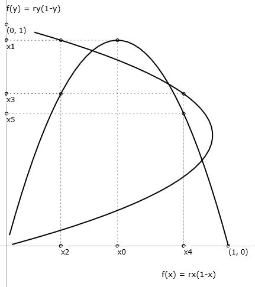

The sequence continues in the same manner — "bouncing" between the direct and inverse Logistic Map.

---

## 6. Inverse Cobweb Diagram

A cobweb diagram is a geometric visualization of repeated function iteration [4]. Traditionally, it shows how values "bounce" between the function curve $y = f(x)$ and the diagonal line $y = x$. In this paper, we replace the diagonal line with the inverse function curve $y = f^{-1}(x)$:
$$
y = \frac{1}{2}\left(1 \pm \sqrt{1-4\frac{x}{r}}\right)
$$
This approach provides an alternative geometric perspective on the dynamics of the logistic map.

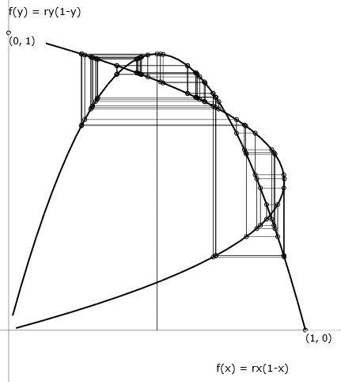

---

## 7. Stable Iteration Cycle with Three Nodes

For certain values of $r$ (denoted as $r_{o3}$), the iteration sequence stabilizes into a three-node cycle. The existence of a period-3 orbit is of particular significance: by the theorem of Li and Yorke [2], period three implies chaos for any continuous self-map of an interval. To calculate $r_{o3}$, we need to solve the following two equations:

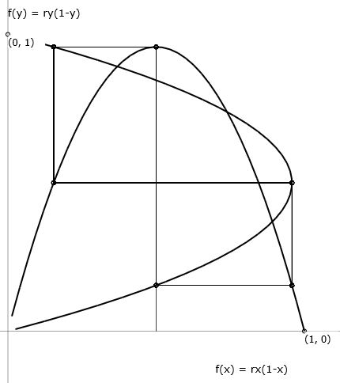

### Equation 1

$$
f(x) = \frac{1}{2}, \quad r > 2
$$
$$
rx(1-x) = \frac{1}{2}
$$
Solutions for $r > 2$:
$$
x_{o1} = \frac{r-\sqrt{(r-2)r}}{2r}
$$
$$
x_{o2} = \frac{r+\sqrt{(r-2)r}}{2r}
$$

### Equation 2

$$
f^{-1}(x_{o1}) = f\left(\frac{1}{2}\right), \quad r > 2
$$
$$
\frac{1}{2}\left(1+\sqrt{1-4\frac{r-\sqrt{(r-2)r}}{2r^2}}\right) = \frac{r}{4}
$$

The solution for $r > 2$ is:
$$
r_{o3} = 1 + \sqrt{1 + \frac{1}{3}\left(8 + (800 - 96\sqrt{69})^{1/3} + 2 \cdot 2^{2/3}(25 + 3\sqrt{69})^{1/3}\right)}
$$
$$
r_{o3} \approx 3.8318740552833155684103627754961065557978278526036946304788904477
$$

---

## 8. Bifurcation Diagrams

### 8.1 Logistic Map

Since the iteration values "bounce" between the direct and inverse Logistic Map, we can identify two bifurcation sets [3]:

#### 8.1.1 Bifurcation diagram on y-axis

#### 8.1.2 Bifurcation diagram on x-axis

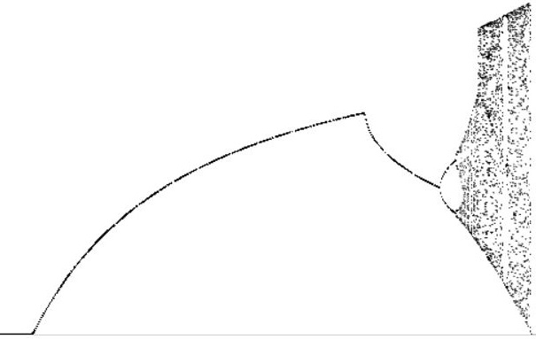

### 8.2 Sinusoidal Variant

The bifurcation diagram for $f(x) = \frac{r}{4} \sin(\pi x)$ provides an alternative perspective on the dynamics of similar endofunctions.

#### 8.2.1 Bifurcation diagram on y-axis

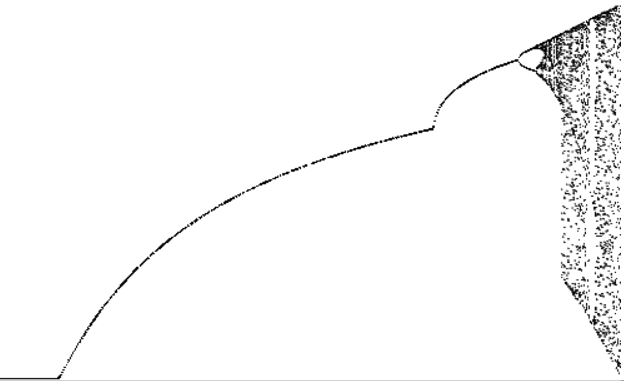

#### 8.2.2 Bifurcation diagram on x-axis

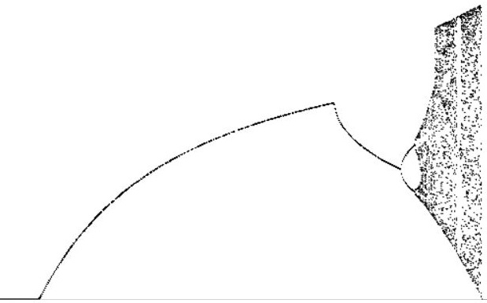

---

## 9. Conclusion

This paper has presented a detailed analysis of the logistic map, its inverse, and their interplay. By exploring the iterative dynamics and constructing the inverse cobweb diagram, we have gained new insights into the behavior of controlled chaos. The identification of a stable three-node cycle and the bifurcation diagrams further highlight the richness of this mathematical system.

---

## References

1. May, R. M. (1976). "Simple mathematical models with very complicated dynamics." *Nature*, 261(5560), 459–467.
2. Li, T. Y., & Yorke, J. A. (1975). "Period three implies chaos." *The American Mathematical Monthly*, 82(10), 985–992.
3. Feigenbaum, M. J. (1978). "Quantitative universality for a class of nonlinear transformations." *Journal of Statistical Physics*, 19(1), 25–52.
4. Strogatz, S. H. (2018). *Nonlinear Dynamics and Chaos: With Applications to Physics, Biology, Chemistry, and Engineering* (2nd ed.). CRC Press.
5. Devaney, R. L. (1989). *An Introduction to Chaotic Dynamical Systems* (2nd ed.). Addison-Wesley.
